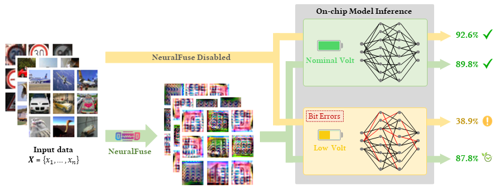

# NeuralFuse

Official repo to reproduce the paper "[NeuralFuse: Learning to Recover the Accuracy of Access-Limited Neural Network Inference in Low-Voltage Regimes](https://arxiv.org/abs/2306.16869)."



Deep neural networks (DNNs) have become ubiquitous in machine learning, but their energy consumption remains a notable issue. Lowering the supply voltage is an effective strategy for reducing energy consumption. However, aggressively scaling down the supply voltage can lead to accuracy degradation due to random bit flips in static random access memory (SRAM) where model parameters are stored. To address this challenge, we introduce NeuralFuse, a novel add-on module that addresses the accuracy-energy tradeoff in low-voltage regimes by learning input transformations to generate error-resistant data representations. NeuralFuse protects DNN accuracy in both nominal and low-voltage scenarios. Moreover, NeuralFuse is easy to implement and can be readily applied to DNNs with limited access, such as non-configurable hardware or remote access to cloud-based APIs. Experimental results demonstrate that, at a 1% bit error rate, NeuralFuse can reduce SRAM memory access energy by up to 24% while recovering accuracy by up to 57%. To the best of our knowledge, this is the first model-agnostic approach (i.e., no model retraining) to address low-voltage-induced bit errors.

## Run Base Model Training with QAT:
```python
python zs_main.py [resnet18 | resnet50 | vgg11 | vgg16 | vgg19] train [cifar10 | gtsrb | cifar100 | imagenet224] -E 300 -LR 0.001 -BS 256 
```

## Run NerualFuse Training:
```python
python zs_main.py [resnet18 | resnet50 | vgg11 | vgg16 | vgg19] transform_eopm_gen [cifar10 | gtsrb | cifar100 | imagenet224] -ber 0.01 -cp [please input the model path here] -E 300 -LR 0.001 -BS 256 -LM 5 -N 10 -G [ConvL | ConvS | DeConvL | DeConvS | UNetL | UNetS]
```

## Run NerualFuse Evaluation with Perturbed Base Model: 
Please set the setting in config.py first. 

For example, in config.py:

```python
'''
cfg.testing_mode: Choosing the evaluation mode.
    1. clean: Evaluate the clean accuracy of specific base model. 
    2. generator_base: Evalueate the improved accuracy by NeuralFuse on specific perturbed base model.
cfg.G_PATH: The path of the NeuralFuse model.
'''
cfg.testing_mode = 'generator_base' # clean / generator_base
cfg.G_PATH = ''  # Only work in generator_base mode.
```

```python
python zs_main.py [resnet18 | resnet50 | vgg11 | vgg16 | vgg19] transform_eval [cifar10 | gtsrb | cifar100 | imagenet224] -ber 0.01 -cp [please input the model path here] -BS 256 -TBS 256 -G [ConvL | ConvS | DeConvL | DeConvS | UNetL | UNetS]
```

## Arguments:
* ```-ber```: Random bit error rate. Should be in range (0, 1).
* ```-cp``` : Checkpoint. The path of the checkpoints of the base model.
* ```-E```  : Epoch. The training epoch.
* ```-LR``` : Learning rate. The learning rate for training.
* ```-LM``` : Lambda. Controling the tradeoff between clean loss and perturbed loss.
* ```-N```  : The number of perturbed models to calculate the loss proposed in our EOPM algorithm.
* ```-BS``` : Batch size for training.
* ```-TBS```: Batch size for testing.
* ```-G```  : Generator. The architecture of the NeuralFuse generator for training.

## Choose Dataset:
* Cifar10
* Cifar100
* Gtsrb
* Imagenet10

## Notes:
We also adopt the Pytorch offical architecture settings for all of the base models. To use the version of Pytorch offical implementation, please change the args into [resnet18Py | resnet50Py | vgg11Py | vgg16Py | vgg19Py] instead.

## Citation
If you find this helpful for your research, please cite our paper as follows:

    @article{sun2023neuralfuse,
      title={{NeuralFuse: Learning to Recover the Accuracy of Access-Limited Neural Network Inference in Low-Voltage Regimes}},
      author={Hao-Lun Sun and Lei Hsiung and Nandhini Chandramoorthy and Pin-Yu Chen and Tsung-Yi Ho},
      journal={arXiv preprint arXiv:2306.16869},
      year={2023}
    }

